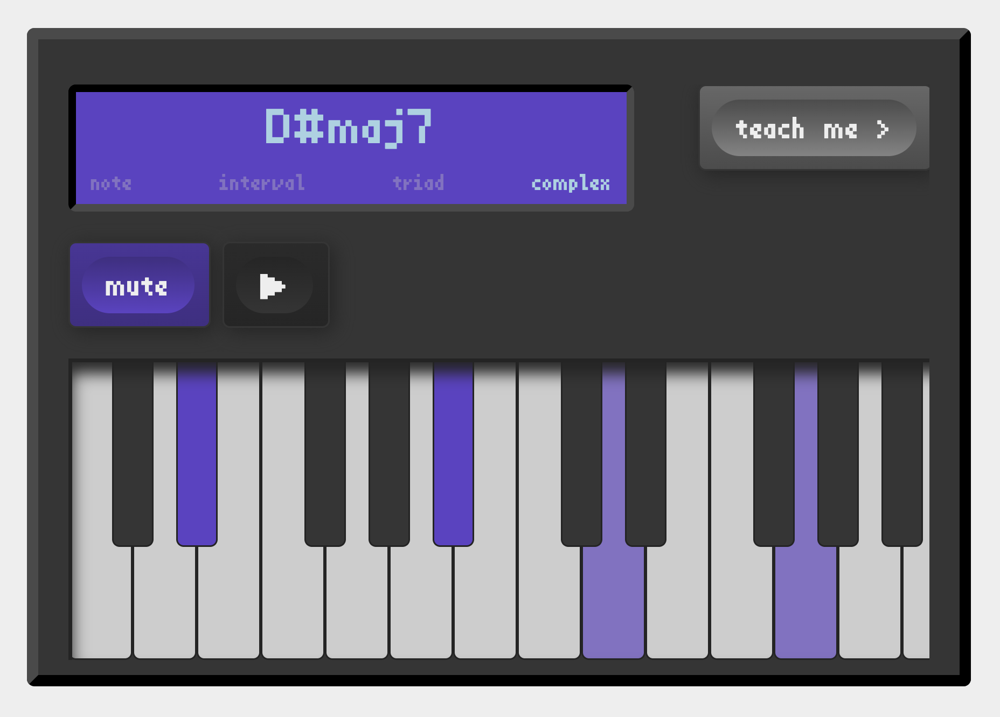

```text
░█▀█░█▀█░█▀▄░█▀▄░▀█▀░█▀▀░▀░█▀▀      
░█▀█░█░█░█░█░█▀▄░░█░░▀▀█░░░▀▀█      
░▀░▀░▀░▀░▀▀░░▀░▀░▀▀▀░▀▀▀░░░▀▀▀      
░█▀█░█▀█░█▀▄░▀█▀░█▀▀░█▀█░█░░░▀█▀░█▀█
░█▀▀░█░█░█▀▄░░█░░█▀▀░█░█░█░░░░█░░█░█
░▀░░░▀▀▀░▀░▀░░▀░░▀░░░▀▀▀░▀▀▀░▀▀▀░▀▀▀
```

my finest work ★ say hi at andris.fajkusz@gmail.com

<br/>

```text
▄▖      ▄▖▗     ▌ 
▌▌█▌▛▘▛▌▚ ▜▘▀▌▛▘▙▘
▛▌▙▖▌ ▙▌▄▌▐▖█▌▙▖▛▖

```

  

[take a look](https://aerostack.xyz) ★ `cloudflare` `hono` `vanilla js`  

A community site for the glorious niche of AeroPress _(a plastic tube for coffee brewing)_. This project was born in the curiousity of wanting to see just how bad life would be without frontend frameworks, and honestly the challenges that it posed were refreshing. Also, going cloudflare native is just simply _the way to go_, it enabled me to ship an AI curator that checks new recipes every night and removes the spam-y ones in just 60 lines. The recipe pages's brutalist design is brought to life by the custom [dynamic art generator](https://aerostack.xyz/asset-generator) that gives each coffee recipe it's own vibe, which is also reflected on link previews.

<br/>

```text
•   ┓•      ┓      ┓
┓┏┓┏┫┓┏┓┏┓ ┏┣┓┏┓┏┓┏┫
┗┛┗┗┻┗┗┫┗┛━┗┛┗┗┛┛ ┗┻
       ┛            
```

  

[take a look](https://indigo-chord.vercel.app) ★ `svelte` `typescript`

This project was born as a way to showcase some of my work after researching the _formal model of popular music_ for a few years. Not shy to say I've come up with the best overall chord naming algorithm by breaking away from mainstream music theory. The aim of this app is to walk you through that boringly scientific identification process on _fun user interface_. Also, finally using svelte for something I actually end up shipping. Probably the most interesting bit design-wise was coming up with a responsive keyboard design and making the UI look and feel like a casette player.


<br/>

```text
▄▄▄▄▄ ▄▄▄▄  ▄▄▄▄▄ ▄▄▄▄▄        
██▄▄  ██▄█▄ ██▄▄  ██▄▄         
██    ██ ██ ██▄▄▄ ██▄▄▄        
                                 
▄▄▄▄▄▄ ▄▄▄▄   ▄▄▄  ▄▄▄▄  ▄▄▄▄▄ 
  ██   ██▄█▄ ██▀██ ██▀██ ██▄▄  
  ██   ██ ██ ██▀██ ████▀ ██▄▄▄ 
```
[take a look](https://web.freetrade.io/universe/US/RDDT) ★ `next.js` `react` `typescript` `tailwindcss` `graphql`

  